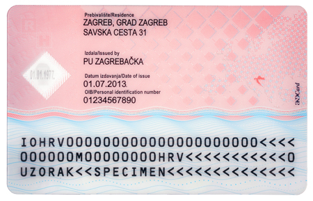
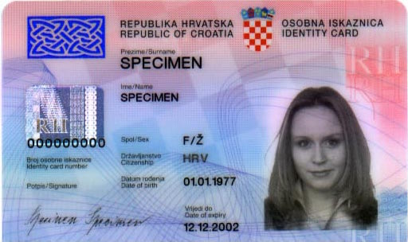
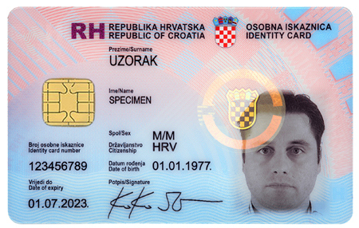

Customizing BlinkID with Templating API
===========================================

This article will discuss how templating API can be used to perform scanning of documents which are not supported out of the box by BlinkID SDK.

The templating API is an extension to existing BlinkOCR and MRTD recognizers which are already part of BlinkID SDK. Until now, BlinkOCR recognizer could only be used together with parsers to add support for SegmentScan and MRTD recognizer only supported scanning Machine Readable Zone of documents with MRZ. 

The [next section](#mrtdTemplating) will explain how to use templating API extension of MRTD recognizer to also scan fields outside of the Machine Readable Zone. The [section after](#blinkOcrTemplating) will explain how to use templating API extension of BlinkOCR recognizer to scan fields in documents without Machine Redable Zone.

## <a name="mrtdTemplating"></a> Templating API for MRTD

This section will explain how to use templating API for MRTD to add support for scanning back side of [Croatian identity card](https://en.wikipedia.org/wiki/Croatian_identity_card). Code samples will be written in Java, using Android BlinkID SDK. The entire code sample which will be explained here can be found [here](https://github.com/BlinkID/blinkid-android/blob/0524096b6b2410d7e7235a12c6b7fd60dc3127fa/BlinkIDDemo/BlinkIDDemo/src/main/java/com/microblink/util/templating/CroatianIDBackSide.java).

Let's start by examining how back side of Croatian Identity card looks like. Here are the pictures of back sides of both old and new versions of Croatian Identity card:




The idea of templating API is to let MRTD recognizer find and parse the Machine Readable Zone and determine the entire location of the document. After that, locations defined with DecodingInfo objects are cropped from document and OCR is performed on them and parsers are run to extract relevant information.

Let's show how to do this step by step.

First, we need to instatiate [MRTDRecognizerSettings](https://blinkid.github.io/blinkid-android/com/microblink/recognizers/blinkid/mrtd/MRTDRecognizerSettings.html):

```java
MRTDRecognizerSettings settings = new MRTDRecognizerSettings();
```

Since there are two versions of ID cards, we will need two lists of decoding locations - one for old ID card and one for new ID card:

```java
List<DecodingInfo> oldIdDecodingInfos = new ArrayList<>();
List<DecodingInfo> newIdDecodingInfos = new ArrayList<>();
```

Now, we will setup the locations and extraction rules for extracting address, issued by and date of issue fields:

```java
setupAddress(settings, oldIdDecodingInfos, newIdDecodingInfos);
setupIssuedBy(settings, oldIdDecodingInfos, newIdDecodingInfos);
setupDateOfIssue(settings, oldIdDecodingInfos, newIdDecodingInfos);
```

[It will be shown later](#mrtdExtractionRules) how those methods should be implemented. For now we will only say that these methods will set up the parsing rules for address, issued by and date of issue fields and will also define locations of those fields on both old and new versions of Croatian identity card.

Now, we only need to define which decoding infos belong to which class with method [setParserDecodingInfos](https://blinkid.github.io/blinkid-android/com/microblink/recognizers/templating/TemplatingRecognizerSettings.html#setParserDecodingInfos-com.microblink.detectors.DecodingInfo:A-java.lang.String-):

```java
settings.setParserDecodingInfos(listToArray(newIdDecodingInfos), CLASS_NEW_ID);
settings.setParserDecodingInfos(listToArray(oldIdDecodingInfos), CLASS_OLD_ID);
```

`CLASS_NEW_ID` and `CLASS_OLD_ID` are string constants which can be defined arbitrarly - it is only important that document classifier returns same constant when determining the correct type of document. [It will be shown later](#mrtdClassifier) how document classifier can be implemented, for now let's only see how to define which one to use:

```java
settings.setDocumentClassifier(new CroBackIdClassifier());
```

### <a name="mrtdExtractionRules"></a> Defining extraction rules and locations

Let's now see how previously mentioned methods `setupAddress`, `setupIssuedBy` and `setupDateOfIssue` should be implemented. We will start with `setupAddress`. The signature of the method is as follows:

```java
private static void setupAddress(TemplatingRecognizerSettings settings, List<DecodingInfo> oldId, List<DecodingInfo> newId)
``` 

First, we need to precisely define the location of the address field inside the document. 


To measure that, we take a ruler and first measure the dimensions of the document. For Croatian Identity card, we measure 85 mm width and 54 mm height. After that we need to measure the location of the address field. After measuring we see that address field starts from 21 mm from the left and 3 mm from the top and has width of 39 mm and height of 8 mm.

Templating API requires setting all locations in relative coordinate system, i.e. in system where document has width and height of 1.0. Let's do this:

```
x = 21mm / 85mm = 0.247
y = 3mm / 54mm = 0.056
width = 39 mm / 85mm = 0.459
height = 8 mm / 54mm = 0.148
```

Now we have almost all information needed for defining how address field should be read from back side of Croatian Identity card. The only thing that's left is height of the dewarped image segment that will contain the address. The OCR works best when height of text which is being recognised is around 80 pixels per character. Since the box we measured contains a bit more space than address text does and address box contains two lines, we will set the dewarp image height to 200 pixels. To sum it up in single line of code:

```java
oldId.add(new DecodingInfo(new Rectangle(0.247f, 0.056f, 0.459f, 0.148f), 200, ID_ADDRESS));
```

Similarly, on back side of new Croatian Identity card we measure 21 mm from the left and 3 mm from the top and width 39 mm and height 10 mm which contains 3 lines of address in smaller font, so we will use 300 pixels for dewarp height:

```java
newId.add(new DecodingInfo(new Rectangle(0.247f, 0.056f, 0.459f, 0.185f), 300, ID_ADDRESS));
```

The `ID_ADDRESS` is a string constant which defines the name of the location and also the name of parser group which will contain the parser which will know how to extract address from raw OCR result.

For extracting address, we will use regular expression which will use one or more words in the first line of the text followed by one or more words in the second line of text followed by number consisting of one or more digits - first line contains name of the city while second line contains street name and number. For parsing generic regular expressions, we use the [RegexParser](https://blinkid.github.io/blinkid-android/com/microblink/recognizers/blinkocr/parser/regex/RegexParserSettings.html):

```java
RegexParserSettings addressParser = new RegexParserSettings("([A-ZŠĐŽČĆ]+,? ?)+\n([A-ZŠĐŽČĆ]+ ?)+\\d+");
```

We can further configure OCR engine options that will be used before applying regular expression matching. To improve OCR result quality, we will only allow uppercase letters and digits in OCR whitelist:

```java
addressParser.getOcrEngineOptions().addAllDigitsToWhitelist(OcrFont.OCR_FONT_ANY)
								   .addUppercaseCharsToWhitelist(OcrFont.OCR_FONT_ANY)
								   .addCharToWhitelist('Š', OcrFont.OCR_FONT_ANY)
								   .addCharToWhitelist('Đ', OcrFont.OCR_FONT_ANY)
								   .addCharToWhitelist('Ž', OcrFont.OCR_FONT_ANY)
								   .addCharToWhitelist('Č', OcrFont.OCR_FONT_ANY)
								   .addCharToWhitelist('Ć', OcrFont.OCR_FONT_ANY);
```

We will also define minimum char height to prevent classification of very small characters which can drastically reduce the quality of OCR:

```java
addressParser.getOcrEngineOptions().setMinimumCharHeight(35);
```

There are lots more options that can be configured. Please consult [javadoc](https://blinkid.github.io/blinkid-android/com/microblink/recognizers/blinkocr/engine/BlinkOCREngineOptions.html) for more information.

Finally, we need to add `addressParser` to parser group which has the same name as [DecodingInfo](https://blinkid.github.io/blinkid-android/com/microblink/detectors/DecodingInfo.html) defined earlier:

```java
settings.addParserToParserGroup(ID_ADDRESS, ID_ADDRESS, addressParser);
```

When all this is combined, the final `setupAddress` method looks like this:

```java
private static void setupAddress(TemplatingRecognizerSettings settings, List<DecodingInfo> oldId, List<DecodingInfo> newId) {
    RegexParserSettings addressParser = new RegexParserSettings("([A-ZŠĐŽČĆ]+,? ?)+\n([A-ZŠĐŽČĆ]+ ?)+\\d+");
    
    addressParser.getOcrEngineOptions().addAllDigitsToWhitelist(OcrFont.OCR_FONT_ANY)
								       .addUppercaseCharsToWhitelist(OcrFont.OCR_FONT_ANY)
								   	   .addCharToWhitelist('Š', OcrFont.OCR_FONT_ANY)
								       .addCharToWhitelist('Đ', OcrFont.OCR_FONT_ANY)
								       .addCharToWhitelist('Ž', OcrFont.OCR_FONT_ANY)
								       .addCharToWhitelist('Č', OcrFont.OCR_FONT_ANY)
								       .addCharToWhitelist('Ć', OcrFont.OCR_FONT_ANY);
    addressParser.getOcrEngineOptions().setMinimumCharHeight(35);

    settings.addParserToParserGroup(ID_ADDRESS, ID_ADDRESS, addressParser);

    oldId.add(new DecodingInfo(new Rectangle(0.247f, 0.056f, 0.459f, 0.148f), 200, ID_ADDRESS));
    newId.add(new DecodingInfo(new Rectangle(0.247f, 0.056f, 0.459f, 0.185f), 300, ID_ADDRESS));
}
```

In a similar way should be implemented methods `setupIssuedBy` and `setupDateOfIssue`:

```java
private static void setupIssuedBy(TemplatingRecognizerSettings settings, List<DecodingInfo> oldId, List<DecodingInfo> newId) {
    RegexParserSettings issuedByParser = new RegexParserSettings("P[PU] ([A-ZŠĐŽČĆ]+ ?)+");
    
    issuedByParser.getOcrEngineOptions().addUppercaseCharsToWhitelist(OcrFont.OCR_FONT_ANY)
								   	    .addCharToWhitelist('Š', OcrFont.OCR_FONT_ANY)
								        .addCharToWhitelist('Đ', OcrFont.OCR_FONT_ANY)
								        .addCharToWhitelist('Ž', OcrFont.OCR_FONT_ANY)
								        .addCharToWhitelist('Č', OcrFont.OCR_FONT_ANY)
								        .addCharToWhitelist('Ć', OcrFont.OCR_FONT_ANY);
    issuedByParser.getOcrEngineOptions().setMinimumCharHeight(20);

    settings.addParserToParserGroup(ID_ISSUED_BY, ID_ISSUED_BY, issuedByParser);

    oldId.add(new DecodingInfo(new Rectangle(0.247f, 0.204f, 0.459f, 0.111f), 100, ID_ISSUED_BY));
    newId.add(new DecodingInfo(new Rectangle(0.247f, 0.241f, 0.459f, 0.130f), 100, ID_ISSUED_BY));
}

private static void setupDateOfIssue(TemplatingRecognizerSettings settings, List<DecodingInfo> oldId, List<DecodingInfo> newId) {
    settings.addParserToParserGroup(ID_DATE_OF_ISSUE, ID_DATE_OF_ISSUE, new DateParserSettings());

    oldId.add(new DecodingInfo(new Rectangle(0.247f, 0.315f, 0.282f, 0.111f), 100, ID_DATE_OF_ISSUE));
    newId.add(new DecodingInfo(new Rectangle(0.247f, 0.370f, 0.282f, 0.093f), 100, ID_DATE_OF_ISSUE));
}
```

### <a name="mrtdClassifier"></a> Implementing document classifier

For classifying documents in templating API for MRTD you should implement [MRTDDocumentClassifier](https://blinkid.github.io/blinkid-android/com/microblink/recognizers/blinkid/mrtd/MRTDDocumentClassifier.html) interface. The interface requires you to implement method [classifyDocument](https://blinkid.github.io/blinkid-android/com/microblink/recognizers/blinkid/mrtd/MRTDDocumentClassifier.html#classifyDocument-com.microblink.recognizers.blinkid.mrtd.MRTDRecognitionResult-) which receives [MRTDRecognitionResult](https://blinkid.github.io/blinkid-android/com/microblink/recognizers/blinkid/mrtd/MRTDRecognitionResult.html) which contains information extracted from Machine Readable Zone and possibly information extracted from locations defined with method [setParserDecodingInfos](https://blinkid.github.io/blinkid-android/com/microblink/recognizers/blinkid/mrtd/MRTDRecognizerSettings.html#setParserDecodingInfos-com.microblink.detectors.DecodingInfo:A-) - version which does not require name of the document class.

The role of document classifier is to classify which type of document is being scanned. This information is then used to know which set of locations should be used for extracting remaining information - we do not want to use locations specific for new Croatian identity card when scanning old Croatian identity card and vice versa.

The classifier implementation is always specific to the documents you are scanning - you need to know how to discriminate between documents. In this example we can notice that OPT1 field inside MRZ in new identity card contains personal identification number, while in old identity card it always contains string `"<<<<<<<<<<<<<<<"`. We will use this information to determine whether new or old Croatian identity card is being scanned:

```java
private static class CroBackIdClassifier implements MRTDDocumentClassifier {

        @Override
        public String classifyDocument(MRTDRecognitionResult mrzExtractionResult) {
        	// ensure we are scanning Croatian Identity card
            if ("HRV".equals(mrzExtractionResult.getIssuer()) && "IO".equals(mrzExtractionResult.getDocumentCode())) {
                if ("<<<<<<<<<<<<<<<".equals(mrzExtractionResult.getOpt1())) {
                    return CLASS_OLD_ID;
                } else {
                    return CLASS_NEW_ID;
                }
            }
            // if not scanning Croatian ID, refuse classification
            return null;
        }

        @Override
        public int describeContents() {
            return 0;
        }

        @Override
        public void writeToParcel(Parcel dest, int flags) {
        }

        public CroBackIdClassifier() {
        }

        /**
         * {@link MRTDDocumentClassifier} interface extends {@link android.os.Parcelable} so it can
         * be sent via Intent inside {@link MRTDRecognizerSettings}. In order to be able to extract
         * the classifier from {@link Parcel}, {@link #CREATOR} field must be defined.
         */
        public static final Creator<CroBackIdClassifier> CREATOR = new Creator<CroBackIdClassifier>() {
            @Override
            public CroBackIdClassifier createFromParcel(Parcel source) {
                return new CroBackIdClassifier();
            }

            @Override
            public CroBackIdClassifier[] newArray(int size) {
                return new CroBackIdClassifier[size];
            }
        };
    }
```

## <a name="blinkOcrTemplating"></a> Templating API for generic documents

THis section will explain how to use templating API for generic documents to add support for scanning of [Croatian identity card](https://en.wikipedia.org/wiki/Croatian_identity_card). Code samples will be written in Java, using Android BlinkID SDK. The entire code sample which will be explained here can be found [here](https://github.com/BlinkID/blinkid-android/blob/0524096b6b2410d7e7235a12c6b7fd60dc3127fa/BlinkIDDemo/BlinkIDDemo/src/main/java/com/microblink/util/templating/CroatianIDFrontSide.java).

Let's start by examining how front side of Croatian Identity card looks like. Here are the pictures of front sides of both old and new versions of Croatian Identity card:




The idea of templating API is to combine detector with BlinkOCR recognizer. The detector first locates the document in the camera scene and performs dewarping (cropping and rotating) of elements withing detection, as specified with [DecodingInfo](https://blinkid.github.io/blinkid-android/com/microblink/detectors/DecodingInfo.html) objects inherent to detector. You can define your own Decoding infos on [detectors that can detect quadrilateral objects](https://blinkid.github.io/blinkid-android/com/microblink/detectors/quad/QuadDetectorSettings.html#setDecodingInfos-com.microblink.detectors.DecodingInfo:A-) (credit cards, A4 documents, ...). After that OCR is performed on each location defined by DecodingInfo objects and parsers are run to extract relevant information. Additionaly it is possible to use that information to classify the type of the document and then use additional decoding infos to extract information specific to classified document type.

All this will be shown in this example. First, we will define locations of document number on both old and new versions of ID and then use classifier to tell us whether the scanned document is old or new. After classifications, the recognizer will be able to use correct locations for each document type to extract information.

Let's start in a step by step manner.

First, we need to instatiate [BlinkOCRRecognizerSettings](https://blinkid.github.io/blinkid-android/com/microblink/recognizers/blinkocr/BlinkOCRRecognizerSettings.html):

```java
BlinkOCRRecognizerSettings settings = new BlinkOCRRecognizerSettings();
```

Since there are two versions of ID cards, we will need two lists of decoding locations - one for old ID card and one for new ID card:

```java
List<DecodingInfo> oldIdDecodingInfos = new ArrayList<>();
List<DecodingInfo> newIdDecodingInfos = new ArrayList<>();
```

In order to be able to classify whether document is old ID or new ID, we will also need to provide list of DecodingInfos that will contain locations which will be OCRed before running classifier:

```java
List<DecodingInfo> classificationDecodingInfos = new ArrayList<>();
```

Now, we will setup the locations and extraction rules for extracting first and last name, sex, citizenship, date of birth and document number:

```java
setupName(settings, oldIdDecodingInfos, newIdDecodingInfos, false);
setupName(settings, oldIdDecodingInfos, newIdDecodingInfos, true);
setupSexCitizenshipAndDateOfBirth(settings, oldIdDecodingInfos, newIdDecodingInfos);
// note that document number will be set up into classificationDecodingInfos array
setupDocumentNumber(settings, classificationDecodingInfos);
```

[It will be shown later](#blinkOcrExtractionRules) how those methods should be implemented. For now we will only say that these methods will set up parsing rules for all fields that need to be extracted and will also define locations of those fields on both old and new versions of Croatian identity card. Furthermore, method `setupDocumentNumber` will define parsing rules for extracting document number and locations of document number on both old and new versions of Croatian identity card. Both locations will be put inside same array because these will be used to classify which version of ID card is being scanned.

After classification DecodingInfo array is set, we can set up the detector that will be used for detecting the ID:

```java
// setup card detector
DocumentSpecification idSpec = DocumentSpecification.createFromPreset(DocumentSpecificationPreset.DOCUMENT_SPECIFICATION_PRESET_ID1_CARD);
// set decoding info objects inherent to this document specification
idSpec.setDecodingInfos(listToArray(classificationDecodingInfos));
// create card detector with single document specification
DocumentDetectorSettings dds = new DocumentDetectorSettings(new DocumentSpecification[]{idSpec});

// ensure this detector will be used when performing object detection
settings.setDetectorSettings(dds);
```

For performing detection of ID card, we will use [document detector](https://blinkid.github.io/blinkid-android/com/microblink/detectors/document/DocumentDetectorSettings.html). Document detector can detect one document which conforms to any of the [DocumentSpecifications](https://blinkid.github.io/blinkid-android/com/microblink/detectors/document/DocumentSpecification.html) used in initialisation of document detector. DocumentSpecification object defines low level settings required for accurate detection of document, like aspect ratio, expected positions and much more. Refer to [javadoc](https://blinkid.github.io/blinkid-android/com/microblink/detectors/document/DocumentSpecification.html) for more information. To ease the creation of DocumentSpecification, BlinkID SDK already provides prebuilt DocumentSpecification objects for common document sizes, like ID1 card (credit-card-like document), cheques, etc. You can use method [createFromPreset](https://blinkid.github.io/blinkid-android/com/microblink/detectors/document/DocumentSpecification.html#createFromPreset-com.microblink.detectors.document.DocumentSpecificationPreset-) to automatically obtain DocumentSpecification tweaked with optimal parameters.

DocumentSpecification object also contains array of [DecodingInfo](https://blinkid.github.io/blinkid-android/com/microblink/detectors/DecodingInfo.html) objects which define locations inside detection that need to be dewarped. We will set those DecodingInfos to those set up by `setupDocumentNumber` method.

Next, we need to define which decoding infos belong to which class with method [setParserDecodingInfos](https://blinkid.github.io/blinkid-android/com/microblink/recognizers/templating/TemplatingRecognizerSettings.html#setParserDecodingInfos-com.microblink.detectors.DecodingInfo:A-java.lang.String-):

```java
settings.setParserDecodingInfos(listToArray(newIdDecodingInfos), CLASS_NEW_ID);
settings.setParserDecodingInfos(listToArray(oldIdDecodingInfos), CLASS_OLD_ID);
```

`CLASS_NEW_ID` and `CLASS_OLD_ID` are string constants which can be defined arbitrarly - it is only important that document classifier returns same constant when determining the correct type of document. [It will be shown later](#blinkOcrClassifier) how document classifier can be implemented, for now let's only see how to define which one to use:

```java
settings.setDocumentClassifier(new CroFrontIdClassifier());
```

Finally, we need to add support for correct recognition when document is held upside down. Since card-like documents are symmetric, simple detection of quadrilateral representing the document will not tell us the orientation of the document. For that matter, we need to enable detection of upside down document:

```java
settings.setAllowFlippedRecognition(true);
```

This will ensure that after detection has been performed, classification decoding infos will be dewarped, OCRed and parsed as if detection orientation is correct. If neither of parsers succeeds in parsing OCR data from any location, the detection will be flipped and everything will be repeated. Keep in mind that allowing flipped recognition requires very robust parsing of classification locations.

### <a name="blinkOcrExtractionRules"></a> Defining extraction rules and locations

Let's see now how previously mentioned methods `setupName`, `setupSexCitizenshipAndDateOfBirth` and  `setupDocumentNumber` should be implemented. We will start with `setupDocumentNumber`:

```java
private static void setupDocumentNumber(TemplatingRecognizerSettings settings, List<DecodingInfo> decodingInfos) {
    /**
     * First define locations of document number on both old and new Croatian ID cards. Make sure you use different
     * names to later be able to distinguish which location produced result and which did not.
     */
    decodingInfos.add(new DecodingInfo(new Rectangle(0.047f, 0.519f, 0.224f, 0.111f), 150, ID_DOCUMENT_NUMBER_OLD));
    decodingInfos.add(new DecodingInfo(new Rectangle(0.047f, 0.685f, 0.224f, 0.111f), 150, ID_DOCUMENT_NUMBER_NEW));

    /**
     * Document number on Croatian ID is 9-digit number. We will extract that with simple
     * regex parser which only allows digits in OCR engine settings.
     */
    RegexParserSettings documentNumberParser = new RegexParserSettings("\\d{9}");
    documentNumberParser.getOcrEngineOptions().addAllDigitsToWhitelist(OcrFont.OCR_FONT_ANY);
    documentNumberParser.getOcrEngineOptions().setMinimumCharHeight(35);

    /**
     * It is important to add that parser to both parser groups associated with both decoding infos set above.
     */
    settings.addParserToParserGroup(ID_DOCUMENT_NUMBER_OLD, ID_DOCUMENT_NUMBER, documentNumberParser);
    settings.addParserToParserGroup(ID_DOCUMENT_NUMBER_NEW, ID_DOCUMENT_NUMBER, documentNumberParser);
}
```

The defining of location is done in the same way as in [MRTD example](#mrtdExtractionRules), so we will not repeat the same explanation again. The regex for extracting document number expects 9 digits and OCR engine options allow only digits in whitelist not smaller than 35 pixels.

The interesting part is in last two lines: we add the document number parser to both parser group having the same name as decoding location on old ID and to parser group having the same anme as decoding location on new ID. The rationale behind this is to perform document number parsing on both locations and then classifier will classify document as old version only if parser in parser group `ID_DOCUMENT_NUMBER_OLD` has produced result - similary the classifier will classify document as new version only if parser in parser group `ID_DOCUMENT_NUMBER_NEW` has produced result.

The `ID_DOCUMENT_NUMBER_OLD` and `ID_DOCUMENT_NUMBER_NEW` are arbitrary string constants that will only be used inside document classifier for determining which document number parser has produced the result.

Implementation of method `setupName` is very similar to `setupAddress` discussed [above](#mrtdExtractionRules). Now we will only analyse the case of method `setupSexCitizenshipAndDateOfBirth` since this method shows how multiple parsers can be used on same decoding location:

```java
private static void setupSexCitizenshipAndDateOfBirth(TemplatingRecognizerSettings settings, List<DecodingInfo> oldId, List<DecodingInfo> newId) {
    // first define location on both old and new Croatian IDs
    // set the name of location to ID_SEX_CITIZENSHIP_DOB
    // this will also be the name of parser group containing all parsers
    oldId.add(new DecodingInfo(new Rectangle(0.412f, 0.500f, 0.259f, 0.296f), 300, ID_SEX_CITIZENSHIP_DOB));
    newId.add(new DecodingInfo(new Rectangle(0.388f, 0.500f, 0.282f, 0.296f), 300, ID_SEX_CITIZENSHIP_DOB));

    /**
     * for parsing sex we will use regex parser configured with simple regular expression
     */
    RegexParserSettings sexParser = new RegexParserSettings("[MŽ]/[MF]");
    /**
     * add possible chars to whitelist.
     *
     * Note that since this parser will be in same parser group with other parsers,
     * final whitelist for OCR will be obtained by merging all whitelists of all
     * parsers in same parser group.
     */
    sexParser.getOcrEngineOptions().addCharToWhitelist('M', OcrFont.OCR_FONT_ANY)
            .addCharToWhitelist('F', OcrFont.OCR_FONT_ANY)
            .addCharToWhitelist('Ž', OcrFont.OCR_FONT_ANY)
            .addCharToWhitelist('/', OcrFont.OCR_FONT_ANY);
    sexParser.setMustEndWithWhitespace(true);
    sexParser.setMustStartWithWhitespace(true);

    // this line will add sex parser to parser group: note that parser group
    // name is ID_SEX_CITIZENSHIP_DOB (same as name od DecodingInfo) and name of
    // the parser is ID_SEX
    settings.addParserToParserGroup(ID_SEX_CITIZENSHIP_DOB, ID_SEX, sexParser);

    /**
     * for parsing citizenship we will use regex parser configured with simple regular expression
     * which will be added to same parser group
     */
    RegexParserSettings citizenshipParser = new RegexParserSettings("[A-Z]{3}");
    addAllCroatianUppercaseCharsToWhitelist(citizenshipParser.getOcrEngineOptions());
    citizenshipParser.setMustEndWithWhitespace(true);
    citizenshipParser.setMustStartWithWhitespace(true);

    settings.addParserToParserGroup(ID_SEX_CITIZENSHIP_DOB, ID_CITIZENSHIP, citizenshipParser);

    /**
     * finally, we will add date parser to same parser group.
     */
    settings.addParserToParserGroup(ID_SEX_CITIZENSHIP_DOB, ID_DATE_OF_BIRTH, new DateParserSettings());

    /**
     * So, all parsers in parser group ID_SEX_CITIZENSHIP_DOB will be run on OCR result obtained
     * from image taken from location defined by decoding info of the same name
     */
}
```

The method start off with defining location of field that contains sex, date of birth and citizenship in the usual manner. The DecodingInfo is named `ID_SEX_CITIZENSHIP_DOB`, which is an arbitrary string constant. Next, we define parsers for sex, citizenship and date of birth. For parsing citizenship and sex, we use usual Regex parser, and for parsing date of birth we use the builtin [DateParser](https://blinkid.github.io/blinkid-android/com/microblink/recognizers/blinkocr/parser/generic/DateParserSettings.html). The only important thing to remember is to put all these parsers to same parser group named same as DecodingInfo, i.e. `ID_SEX_CITIZENSHIP_DOB` as is shown above.

### <a name="blinkOcrClassifier"></a> Implementing document classifier

For classifying documents in templating API for generic documents you should implement [DocumentClassifier](https://blinkid.github.io/blinkid-android/com/microblink/recognizers/blinkocr/DocumentClassifier.html) interface. The interface requires you to implement method [classifyDocument](https://blinkid.github.io/blinkid-android/com/microblink/recognizers/blinkocr/DocumentClassifier.html#classifyDocument-com.microblink.recognizers.blinkocr.BlinkOCRRecognitionResult-) which receives [BlinkOCRRecognitionResult](https://blinkid.github.io/blinkid-android/com/microblink/recognizers/blinkocr/BlinkOCRRecognitionResult.html) which contains information extracted from decoding locations defined inside detector.

The role of document classifier is to classify which type of document is being scanned. This information is then used to know which set of locations should be used for extracting remaining information - we do not want to use locations specific for new Croatian identity card when scanning old Croatian identity card and vice versa.

The classifier implementation is always specific to the documents you are scanning - you need to know how to discriminate between documents. In this example we can notice that document number has different place on old and new IDs and in method `setupDocumentNumber` we created two different parser groups for each location. The idea is now to check in classifier on which location has document number been scanned and use that information for correct document classification:

```java
private static class CroFrontIdClassifier implements DocumentClassifier {

    @Override
    public String classifyDocument(BlinkOCRRecognitionResult extractionResult) {
        // we first check if document number parser has succeeded in
        // parsing document number from location on old Croatian ID (Decoding Info object with
        // name ID_DOCUMENT_NUMBER_OLD defined in method setupDocumentNumber above).
        String documentNumber = extractionResult.getParsedResult(ID_DOCUMENT_NUMBER_OLD, ID_DOCUMENT_NUMBER);
        if (documentNumber != null && !"".equals(documentNumber)) {
            // if document number has been successfully parsed from location unique to old
            // Croatian ID, then classify the document as old Croatian ID
            return CLASS_OLD_ID;
        }
        // if document number was not parsed from location unique to old ID, let's check if
        // it has been parsed on location unique to new ID
        documentNumber = extractionResult.getParsedResult(ID_DOCUMENT_NUMBER_NEW, ID_DOCUMENT_NUMBER);
        if (documentNumber != null && !"".equals(documentNumber)) {
            // if document number has been successfully parsed from location unique to new
            // Croatian ID, then classify the document as new Croatian ID
            return CLASS_NEW_ID;
        }
        // if this line is reached, then classifier cannot correctly classify the document
        return null;
    }

    @Override
    public int describeContents() {
        return 0;
    }

    @Override
    public void writeToParcel(Parcel dest, int flags) {
    }

    public CroFrontIdClassifier() {
    }

    protected CroFrontIdClassifier(Parcel in) {
    }

    /**
     * {@link DocumentClassifier} interface extends {@link android.os.Parcelable} so it can
     * be sent via Intent inside {@link BlinkOCRRecognizerSettings}. In order to be able to
     * extract the classifier from {@link Parcel}, {@link #CREATOR} field must be defined.
     */
    public static final Creator<CroFrontIdClassifier> CREATOR = new Creator<CroFrontIdClassifier>() {
        @Override
        public CroFrontIdClassifier createFromParcel(Parcel source) {
            return new CroFrontIdClassifier(source);
        }

        @Override
        public CroFrontIdClassifier[] newArray(int size) {
            return new CroFrontIdClassifier[size];
        }
    };
}
```